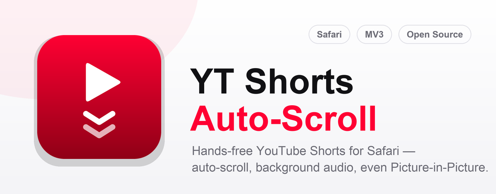
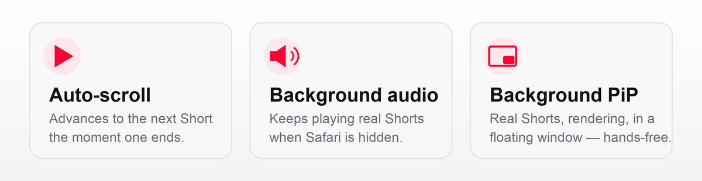

<p align="center"></p>

<p align="center">
  <a href="#install"></a>
  
  
  <a href="LICENSE"></a>
</p>

# YT Shorts Auto-Scroll

A Safari Web Extension that plays YouTube Shorts **hands-free** — it advances
to the next Short the instant one ends, keeps the audio going when Safari is
in the background, and (the genuinely hard part) plays real Shorts in a
**Picture-in-Picture window that keeps advancing on its own, even while Safari
is hidden.**

<p align="center"></p>

- **Auto-scroll Shorts** — when a Short ends, it advances to the next one
  automatically. Toggle it on/off from the toolbar.
- **Background audio** — minimize Safari on a Short and it keeps playing real
  Shorts, one after another, hands-free (audio only, no window).
- **Background Shorts (PiP)** — one tap builds a playlist of upcoming Shorts,
  pops it into a floating Picture-in-Picture window, and keeps advancing
  through **rendered** Shorts even when Safari is in the background.
- **Picture-in-Picture this page** — a universal button that pops whatever
  video is playing on the current tab (any site) into PiP.
- **Zero dependencies, zero build step** for the extension itself — plain JS,
  MV3, promise-based `browser.*` APIs.

## Why this exists

Poll-based Shorts auto-scrollers (the userscripts and Chrome extensions you'll
find) all work the same way — a timer that clicks YouTube's *next* button — and
they all break the moment the tab isn't in the foreground, because **Safari
suspends timers and the rendering pipeline for hidden tabs.** This extension is
event-driven off the media pipeline instead, so it keeps working where the
others stop. Getting Shorts to play *in a background PiP window* took cracking
three separate Safari/YouTube behaviours (see [How it works](#how-it-works)).

## Install

There are two ways to run it. The temporary path needs no build; the Xcode path
gives you a persistent install.

### (a) Temporary extension — fastest, no Xcode (Safari 26+)

1. Safari → Settings → **Advanced** → check **"Show features for web
   developers"**.
2. A **Developer** tab appears in Settings. Open it → **"Add Temporary
   Extension…"** → select this repo's `extension/` folder.
3. It's active until Safari quits — repeat to reload (e.g. after `git pull`).

### (b) Xcode build — persistent install

The generated Xcode project is **committed**, so you don't need to run the
packager — just open and run.

1. `open "xcode/YT Shorts Auto-Scroll/YT Shorts Auto-Scroll.xcodeproj"`
2. Select the app target → **Signing & Capabilities** → choose **your own
   team** (a free personal Apple ID works). Press **⌘R**.
   - No Apple ID? Use ad-hoc signing and enable Safari → Settings → Developer →
     **"Allow unsigned extensions"** (this resets every time Safari quits).
3. Safari → Settings → **Extensions** → enable **YT Shorts Auto-Scroll**.
4. On youtube.com, click the toolbar icon once and choose **"Always Allow on
   This Website"** (one-time; the content script is inert until you do).

<details>
<summary>Regenerating the Xcode project from source (rarely needed)</summary>

```bash
xcodebuild -runFirstLaunch   # once per machine, or the packager crashes
xcrun safari-web-extension-packager extension/ \
  --project-location xcode --app-name "YT Shorts Auto-Scroll" \
  --bundle-identifier com.gokulmc.yt-shorts-autoscroll \
  --swift --macos-only --no-open --no-prompt --force
```

The packager derives the **app** target's bundle id from the app name rather
than honouring `--bundle-identifier`; fix `PRODUCT_BUNDLE_IDENTIFIER` for the
app target to `com.gokulmc.yt-shorts-autoscroll` or the build fails
embedded-binary validation.
</details>

## Usage

- **Toolbar icon** → popup. The icon is full-colour when auto-scroll is on,
  grey/translucent when off.
- **Auto-scroll Shorts** toggle — advances Shorts as you watch. Turn it off to
  restore YouTube's native looping.
- **▶ Background Shorts (PiP)** — on a Short, tap this. It shows a 10-second
  "Setting up…" countdown while it builds the playlist and loads the player,
  then lands on a playlist page with a red **"▶ Start background Shorts"**
  button. Click that once to enter PiP, then minimize Safari — it keeps playing
  rendered Shorts hands-free.
- **Picture-in-Picture this page** — pops the current tab's video into PiP,
  works on any site.

## How it works

Three Safari behaviours stand between "click next on a timer" and "hands-free
Shorts in a background PiP window." Here's each, and how the extension gets
around it.

### 1. Auto-advance without a timer

Safari clamps `setInterval` to ≥1 s and suspends it entirely for hidden or
occluded tabs, so any poll-based "check if the Short ended, click next" loop
dies in the background. Instead, `content.js` installs **capture-phase media
listeners on `document`** at `document_start`:

```js
document.addEventListener('ended', onEnded, true);      // fires per Short, timer-free
document.addEventListener('timeupdate', keepLoopOff, true); // re-defeat YouTube's per-video loop
```

Media events are driven by the browser's media pipeline, not the timer queue,
so they keep firing while the video plays — even hidden, even in PiP. On
`ended`, the extension advances; a loop-restart guard catches the case where
YouTube's own `loop=true` wins the race.

### 2. Background audio: `loadVideoById`, not scroll

YouTube advances Shorts with a **compositor-driven scroll animation**, and the
compositor is frozen for hidden tabs — so clicking *next* or pressing ArrowDown
queues a scroll that only completes when you look at the tab again. Regular
`/watch` autoplay, by contrast, swaps the next video's *stream* into the same
`<video>` element (no scroll), which is why it keeps working in the background.

So in a hidden tab the extension does the same thing to Shorts: it reads the
page-world player (`document.getElementById('shorts-player')`) and calls
`loadVideoById(nextId)` to swap the stream in place — no scroll, no navigation.
The upcoming Short IDs come from YouTube's own `reel_watch_sequence` endpoint,
seeded by a `sequenceParams` value **constructed from the current video ID**
(it's base64 protobuf: `[0x0a,0x0b] + videoId + a constant tail`), so it's
reliable even on cold loads where the page globals are empty.

### 3. Background Shorts in PiP: playlist + the "bounce"

This is the one nobody else does, because two Safari facts fight you:

- **Any programmatic stream swap closes or blanks PiP.** `loadVideoById` tears
  the PiP window down; a playlist advance leaves the window "active" but
  **blank** — audio plays, frames decode, nothing paints.
- **Only YouTube's native playlist autoplay** advances without navigating away
  (which would close PiP with a "leaving this page" prompt).

The fix is two-part:

1. **A temporary playlist of Shorts.** One tap builds
   `https://www.youtube.com/watch_videos?video_ids=…` (up to 50 IDs) from the
   reel sequence — extracting **only** `reelWatchEndpoint` video IDs, because
   grabbing every `videoId` in the response pulls in recommended *landscape*
   videos and pollutes the feed. YouTube's native playlist autoplay then
   advances through the Shorts in the regular player, which can hold a PiP
   session.
2. **The PiP bounce.** After each advance the window is blank, so the extension
   exits PiP and immediately re-enters it — `webkitSetPresentationMode('inline')`
   then `('picture-in-picture')` — which forces Safari to build a **fresh,
   rendering** PiP surface. Crucially this works **while Safari is hidden**,
   because Safari lifts the user-gesture requirement for PiP after your first
   manual entry.

```js
// on each advance, once the user has entered PiP:
video.webkitSetPresentationMode('inline');          // force the drop
// …then poll until Safari lets us back in (it refuses until teardown finishes):
const reenter = () => video.webkitPresentationMode === 'picture-in-picture'
  ? done()
  : (video.webkitSetPresentationMode('picture-in-picture'), setTimeout(reenter, 150));
```

There's an unavoidable **~1.5-second flicker** between Shorts: that's Safari's
own PiP teardown time, and it physically refuses to re-open the window faster —
verified by trying every timing. Since Shorts are 15–60 s each, it's one brief
flicker per Short.

### How this was figured out

Rather than guess at YouTube's internals, the whole thing was reverse-engineered
against a live, logged-in Safari tab driven by AppleScript. The harness in
[`test/`](test/) runs JavaScript in the real page and reads back the result:

```bash
./test/run-async-in-safari.sh test/probe-buildlist.js   # e.g. builds a clean 50-Short playlist
```

It needs Safari → Settings → Developer → **"Allow JavaScript from Apple
Events"**. It's how every claim above ("the advance blanks PiP", "re-entry
takes ~1.5 s", "the sequence seed is the videoId") was measured instead of
assumed.

## Permissions

`["storage", "activeTab", "scripting"]` plus a host permission for
`www.youtube.com`.

- **On youtube.com**, the first toolbar click shows Safari's per-site
  permission sheet — choose **"Always Allow on This Website"** (one-time). The
  content script does nothing until then.
- **On other sites**, only `activeTab` is used — Safari grants it silently for
  the current tab when you click the toolbar icon, for the "PiP this page"
  button.

## Troubleshooting

- **Changes not showing after a rebuild** — toggle the extension off/on in
  Safari → Settings → Extensions.
- **"Allow unsigned extensions" keeps turning off** — that's expected; it
  resets on every Safari quit. Sign with your own Apple ID team (Install step
  b2) for a setting that persists.
- **PiP shows black after an advance** — it should re-render within ~1.5 s (the
  bounce). If it stays black, your build predates the bounce fix — rebuild from
  `main`.
- **Background Shorts plays a landscape video** — you're on a stale playlist
  from an older build; the current build extracts Shorts-only IDs.
- **Settings don't apply** — Safari profiles each keep their own `storage`;
  check you're in the profile you're browsing in.

## Not on the App Store

This is a local, non-notarized build with no App Store distribution planned —
build it from source (Install above). Don't attach a built `.app` to a GitHub
Release: a personal-team build isn't Developer-ID-signed or notarized, so
Gatekeeper blocks it on other Macs.

## Repo layout

```
extension/          WebExtension source — the single source of truth
  manifest.json     MV3, no background page beyond the icon/PiP worker
  content.js        auto-advance, background loadVideoById, the PiP bounce
  background.js     toolbar icon sync + MAIN-world reel/loadVideoById injection
  pip-inject.js     universal "PiP this page"
  popup/            toolbar popup (toggle, buttons, countdown)
  images/           generated icons (tile + template toolbar glyphs)
assets/, scripts/   icon.svg + PIL generators (icons and these README images)
xcode/              committed Safari wrapper project (open & run)
test/               AppleScript harness that cracked the PiP behaviour
```

## License

[MIT](LICENSE)
